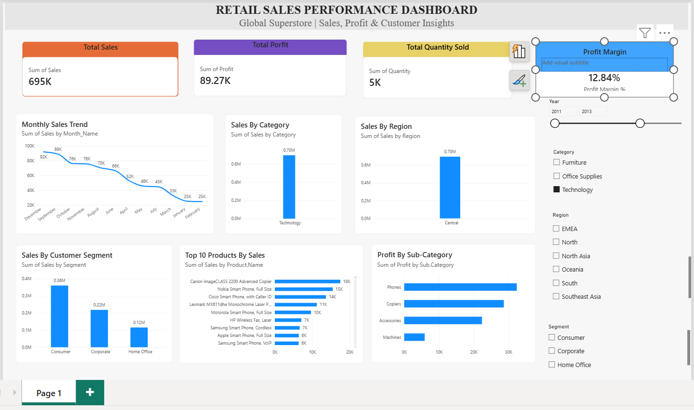

# Retail Sales Performance Analysis

## 📌 Project Overview

This project analyzes historical retail sales data to identify key performance indicators (KPIs), sales trends, top-performing products, regional performance, customer segment performance, and profitability patterns.

The project uses Python for data cleaning and exploratory data analysis (EDA), and Power BI to create an interactive sales performance dashboard.

---

## 🎯 Objectives

- Analyze historical retail sales data.
- Identify key performance indicators such as sales, profit, quantity, and profit margin.
- Identify top-performing products and categories.
- Analyze sales trends across months and years.
- Analyze regional and customer segment performance.
- Identify profitable and loss-making sub-categories.
- Provide actionable recommendations for improving sales performance.

---

## 🛠️ Tools & Technologies

- Python
- Pandas
- NumPy
- Matplotlib
- Jupyter Notebook
- Power BI
- DAX

---

## 🧹 Data Cleaning & Preprocessing

The dataset was cleaned and prepared using Python.

The following steps were performed:

- Checked for missing values.
- Checked for duplicate records.
- Converted date columns into datetime format.
- Created month and month-name columns for time-series analysis.
- Prepared the cleaned dataset for Power BI visualization.

### Data Quality

- Missing values: **0**
- Duplicate records: **0**

---

## 📊 Key Performance Indicators

| KPI | Result |
|---|---:|
| Total Sales | 12,642,905 |
| Total Profit | 1,467,457.29 |
| Total Quantity | 178,312 |
| Profit Margin | 11.61% |

---

## 🔎 Exploratory Data Analysis

The analysis covers:

### Product Analysis
Identified the highest-performing products based on sales.

### Category Analysis
Compared sales and profit across product categories.

### Regional Analysis
Compared sales and profitability across regions.

### Customer Segment Analysis
Analyzed sales generated by different customer segments.

### Time-Series Analysis
Analyzed monthly and yearly sales trends and calculated year-over-year growth.

### Profitability Analysis
Compared profit across sub-categories and identified both high-profit and loss-making areas.

---

## 💡 Key Business Insights

1. **Highest-performing product:** Apple Smart Phone, Full Size
2. **Best-performing region:** Central
3. **Peak sales month:** December
4. **Most profitable sub-category:** Copiers
5. **Overall profit margin:** 11.61%

### Additional Findings

- Technology was the highest-performing category in both sales and profit.
- Central was the strongest region in both sales and profit.
- Consumer was the largest customer segment by sales.
- December generated the highest monthly sales, while February recorded the lowest.
- Copiers generated the highest sub-category profit.
- Tables generated a negative profit contribution and require further investigation.
- The highest year-over-year sales growth was 27.2% in 2013.

---

## 📈 Power BI Dashboard
### Dashboard Preview

An interactive Power BI dashboard was developed to visualize the results.

### Dashboard Components

- Total Sales KPI
- Total Profit KPI
- Total Quantity KPI
- Profit Margin KPI
- Monthly Sales Trend
- Sales by Category
- Sales by Region
- Top 10 Products by Sales
- Sales by Customer Segment
- Profit by Sub-Category

### Interactive Filters

- Year
- Region
- Category
- Segment

---

## 💼 Business Recommendations

- Prioritize high-performing Technology products in inventory and marketing planning.
- Analyze successful strategies used in the Central region and evaluate their application to weaker regions.
- Focus customer retention and targeted campaigns on the Consumer segment.
- Prepare inventory and marketing campaigns ahead of peak periods such as December.
- Investigate pricing, discounts, and costs associated with loss-making sub-categories such as Tables.
- Monitor profit margin alongside sales to ensure that revenue growth translates into sustainable profitability.

---

## 📁 Project Files

| File | Description |
|---|---|
| `Retail_Sales_Analysis.ipynb` | Python data cleaning and EDA |
| `Global_Superstore_Cleaned.csv` | Cleaned dataset |
| `Retail_Sales_Performance_Dashboard.pbix` | Power BI dashboard |
| `Retail_Sales_Performance_Analysis_Project_Report.pdf` | Detailed project report |

---

## 🏁 Conclusion

The project provides a comprehensive analysis of retail sales performance using Python and Power BI. The findings identify key revenue drivers, profitable product areas, regional and customer segment performance, and seasonal sales patterns.

The resulting dashboard and recommendations can support data-driven decisions related to inventory planning, marketing strategy, customer targeting, and profitability improvement.
